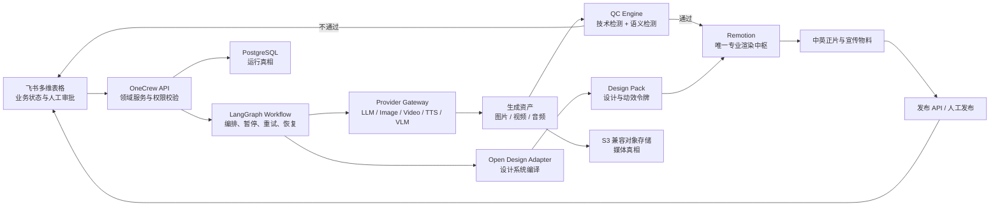
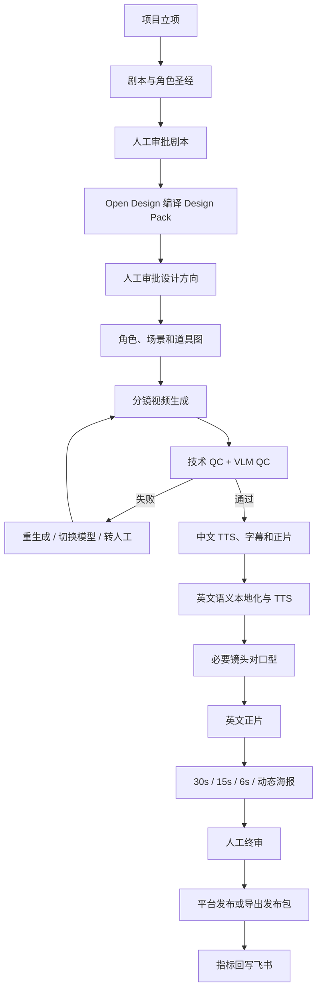

# 星轨 OneCrew 完整系统方案

> 一个人在飞书中管理项目、审批内容和切换模型；后端通过 API 完成剧本、角色、镜头、配音和质检；Open Design 把视觉方向编译成可执行的设计规范；Remotion 统一生成中文正片、英文正片和全部宣传素材。

## 0. 文档使用方式

这份文档是 OneCrew 的唯一设计基线。后续产品、代码、接口、飞书表结构和验收都以本文件为准。

- 产品讨论发生变化时，先更新本文件，再改代码。
- 实现过程中不得另建一套与本方案平行的工作台、渲染器或状态系统。
- `Codex-Goal-交接提示词.md` 是下一轮 Codex Goal 模式可直接使用的执行入口。
- 本文采用标准 Markdown/GFM，适合在 Milkdown 中直接读取和维护。

## 1. 最终产品定义

产品名：**星轨 OneCrew**

产品定位：**飞书控制的中英双语 AI 短剧工厂**。

目标用户是 1～3 人的小型内容团队。系统把分散的文本、图片、视频、配音、质检和宣发 API 编排成一条可追踪、可审批、可重试的生产线。

### 1.1 最终要解决的问题

1. 一个人难以同时管理剧本、分镜、资产、生成任务、质检和发布。
2. 不同生成模型的参数、任务状态、费用和错误格式不一致。
3. AI 视频的角色、服装、场景、口型和字幕容易失去一致性。
4. 中文内容制作完成后，英文版本经常需要重新剪辑。
5. 正片、预告片、竖版短视频、动态海报容易形成多套不一致的视觉风格。
6. 模型失败后缺少明确的人机协作入口。

### 1.2 明确不做的事情

- 不做一个新的通用视频剪辑器。
- 不把飞书当文件服务器或密钥仓库。
- 不同时维护 Remotion 与 HyperFrames 两套正式渲染链路。
- 不把 ComfyUI 作为主工作流平台。
- 不在 MVP 中支持西班牙语，语言仅为 `zh-CN` 与 `en-US`。
- 不一次集成十几个同类模型；每种能力只配置一个首选和一个备用 Provider。
- 不用“演示成功”掩盖未接通的真实 API；Mock、Sandbox 和 Real 必须明确标记。

## 2. 已锁定的架构决策

以下决策在第一版实现中视为固定约束：

1. **飞书是控制面板，不是文件服务器。**
2. **Remotion 是唯一的正式视频包装和成片渲染器。**
3. **Open Design 只负责设计风格输入、设计规范编译与宣传片视觉定义。**
4. **所有外部生成能力经过统一 Provider Adapter，不在业务代码中直接调用厂商接口。**
5. **中文是内容母版，英文通过 Locale Pack 本地化，不重新生成整部作品。**
6. **飞书保存业务真相，后端保存运行真相，对象存储保存媒体真相。**
7. **六张飞书多维表格和四个卡片动作保持固定，不扩张成复杂后台。**
8. **优先通过重新渲染 Remotion 图文与包装层解决问题，只有素材本身失败才重新调用昂贵的生成 API。**

## 3. 总体架构



### 3.1 三类真相来源

| 真相 | 存放位置 | 例子 |
|---|---|---|
| 业务真相 | 飞书 Base | 项目阶段、当前负责人、审批结论、实验数据 |
| 运行真相 | PostgreSQL | Job 状态、重试次数、回调、成本、错误、状态机游标 |
| 媒体真相 | S3 兼容对象存储 | 角色图、镜头视频、配音、字幕、Design Pack、成片 |

飞书中的媒体字段仅保存预览图和有时效的签名访问地址，不保存原始大文件。

## 4. 精简技术栈

### 4.1 五个核心组件

| 组件 | 唯一职责 | 接入方式 |
|---|---|---|
| 飞书开放平台 | 控制、审批、业务数据 | Base API、卡片回调、机器人消息 |
| OneCrew 创作域（吸收 LocalMiniDrama） | 项目、剧集、角色、场景、道具、分镜、首尾帧、素材库和批量生产 | 完整迁移产品能力到 OneCrew 技术栈；允许移植 MIT 代码，但不引入 Vue、SQLite、Electron 或第二套审批工作台 |
| LangGraph | 长流程、人工暂停、失败重试、恢复与模型路由 | TypeScript 图工作流 |
| Open Design | 设计风格输入和 Design Pack 编译 | Adapter、文件导入或受控 sidecar API |
| Remotion | 预览、字幕、动效、正片、宣传片与确定性渲染 | React Composition、Player、Renderer |

FFmpeg/ffprobe 是媒体基础设施；PostgreSQL、Redis 和 S3 兼容存储是运行基础设施；它们不构成新的产品工作台。

### 4.2 推荐工程栈

- TypeScript monorepo：`pnpm` + Turborepo。
- API：Fastify，提供 REST、Webhook 和签名校验。
- 工作流：LangGraph.js。
- 异步任务：BullMQ + Redis。
- 数据库：PostgreSQL + Drizzle ORM。
- 媒体：S3 兼容对象存储，本地开发用 MinIO。
- 渲染：Remotion + `@remotion/renderer`。
- 技术质检：FFmpeg/ffprobe。
- 测试：Vitest + Playwright。
- 本地环境：Docker Compose。

### 4.3 ADR-001：完整吸收 LocalMiniDrama 创作能力

**状态：已接受（2026-07-15）**

OneCrew 不再只把 LocalMiniDrama 当作抽象领域参考，而是把它公开版本中已经验证的创作能力纳入产品完成度目标。迁移遵循“能力完整、架构统一、运行边界唯一”的原则：

- 迁移项目、剧集、剧本、角色、场景、道具、结构化分镜、素材库、首尾帧、连续性、生成历史、批量流水线、工程导入导出和画布编排等产品能力。
- 所有新代码统一进入 OneCrew 的 TypeScript monorepo，使用 Zod/JSON Schema、Fastify、PostgreSQL/Drizzle、Redis/BullMQ、MinIO/S3、React 和 Remotion。
- 可移植上游 MIT 许可下的纯算法、协议兼容和数据转换代码；凡构成实质复制的文件或片段，都在第三方声明中保留来源、提交号、版权和许可证。
- 不引入上游的 Vue 3 前端、Express 运行时、SQLite 数据库或 Electron 桌面壳；这些能力用 OneCrew 的组件重写。
- 不建立第二套审批或业务状态工作台。创作工作台只负责内容生产和素材编辑；审批、放行、切换模型和转人工仍由飞书完成。
- 不建立第二条正式渲染链路。上游的 FFmpeg 合并经验可用于媒体预处理和检测，所有正式成片与宣传物料仍由 Remotion 渲染。
- 不把上游的多厂商配置页面原样搬入产品。Provider 继续经过统一 Adapter，每种能力只保留一个首选和一个备用路由，凭证只进入本机环境或 Secret Manager。
- 飞书六张表保持不变。角色、场景和道具作为资产子类型进入“资产”表；剧集归属和结构化镜头字段进入“项目/分镜”记录及 PostgreSQL 运行模型。

迁移完成度和逐项验收证据由 `docs/localminidrama-adoption.md` 持续维护。该文件是内部工程账本，不用于对外 README 宣传“整合了什么项目”。

## 5. 组件职责边界

### 5.1 飞书

飞书负责：

- 项目立项与阶段状态。
- 分镜和资产的可视化列表。
- Job 的状态、成本、错误与重试入口。
- 脚本、设计、正片和宣传物料审批。
- 四个固定卡片动作。
- 中英文宣发实验数据回写。

飞书不负责：

- 保存 API Key。
- 保存原始视频、音频和图片二进制。
- 运行视频渲染。
- 保存完整 Job 队列与工作流游标。

### 5.2 LangGraph

LangGraph 的图节点只做编排：

```text
project_intake
  -> story_plan
  -> human_approve_story
  -> design_compile
  -> human_approve_design
  -> asset_generation
  -> shot_generation
  -> quality_control
  -> zh_render
  -> en_localization
  -> en_render
  -> campaign_render
  -> human_approve_release
  -> publish
  -> metrics_sync
```

所有人工节点都必须可持久化暂停并在收到飞书事件后恢复，不能依赖进程常驻内存。

### 5.3 Open Design

Open Design 的定位是：**设计方向生成器 + 品牌规范编译器**。

它接收：

- IP 名称、故事简介和受众。
- 中英文品牌名。
- Logo、角色参考图、海报或网页截图。
- 类型、情绪、平台、画幅。
- 希望借鉴和明确禁止的设计风格。

它输出一个版本化 Design Pack：

```text
design-pack/
├── DESIGN.md
├── manifest.json
├── brand.tokens.json
├── motion.tokens.json
├── promo.spec.json
├── templates/
│   ├── title-card.svg
│   ├── lower-third.svg
│   ├── end-card.svg
│   └── poster-frame.svg
└── assets/
    ├── logo.svg
    ├── texture.webp
    └── background.webp
```

正式生产不调用 Open Design/HyperFrames 直接渲染 MP4。可保留其 HTML 快速预览作为设计参考，但 Remotion 是唯一正式渲染器。

### 5.4 Remotion

Remotion 负责：

- 中文和英文字幕。
- 标题、人物名牌、章节卡、片头和片尾。
- Logo 演绎、CTA 和品牌动效。
- 画幅重排、安全区和横转竖。
- 音乐卡点和镜头编排。
- 正片、预告、广告与动态海报。
- Remotion Player 预览页。
- 服务端确定性渲染。

视频生成模型只生成镜头素材，不承担最终字幕、标题和宣传片包装。

## 6. 统一核心数据契约

所有契约定义在 `packages/contracts`，并生成 JSON Schema。飞书、API、Worker 和 Remotion 必须共用同一版本。

### 6.1 ProjectSpec

```ts
export interface ProjectSpec {
  projectId: string;
  nameZh: string;
  nameEn: string;
  synopsis: string;
  audience: string;
  genres: string[];
  ownerOpenId: string;
  locales: Array<'zh-CN' | 'en-US'>;
  aspectRatios: Array<'16:9' | '9:16' | '1:1'>;
  budgetLimitCny: number;
  designSystemId?: string;
  status: ProjectStatus;
}
```

### 6.2 ShotSpec

```ts
export interface ShotSpec {
  shotId: string;
  projectId: string;
  sequence: number;
  durationSec: number;
  characters: string[];
  sceneId: string;
  action: string;
  camera: string;
  dialogueZh?: string;
  prompt: string;
  negativePrompt?: string;
  referenceAssetIds: string[];
  importance: 'normal' | 'hero';
  closeupDialogue: boolean;
  status: ShotStatus;
}
```

### 6.3 DesignPackManifest

```ts
export interface DesignPackManifest {
  designSystemId: string;
  version: string;
  designMdUri: string;
  brandTokensUri: string;
  motionTokensUri: string;
  promoSpecUri: string;
  assetUris: string[];
  source: 'open-design' | 'manual';
  sourceLicense?: string;
  createdAt: string;
}
```

### 6.4 LocalePack

```ts
export interface LocalePack {
  projectId: string;
  locale: 'zh-CN' | 'en-US';
  title: string;
  lines: Array<{
    lineId: string;
    shotId: string;
    speaker: string;
    text: string;
    startMs: number;
    endMs: number;
    voiceId: string;
    audioAssetId?: string;
  }>;
  cta: string;
  marketingCopy: string[];
}
```

### 6.5 RenderManifest

```ts
export interface RenderManifest {
  renderId: string;
  projectId: string;
  compositionId:
    | 'EpisodeMaster'
    | 'EpisodeLocalized'
    | 'Trailer30'
    | 'Teaser15Vertical'
    | 'Bumper6'
    | 'MotionPoster';
  locale: 'zh-CN' | 'en-US';
  aspectRatio: '16:9' | '9:16' | '1:1';
  fps: 30;
  designPack: DesignPackManifest;
  localePack: LocalePack;
  shots: Array<{
    shotId: string;
    videoUri: string;
    inFrame: number;
    outFrame: number;
    crop?: { x: number; y: number; scale: number };
  }>;
  musicUri?: string;
  output: { codec: 'h264'; width: number; height: number };
}
```

### 6.6 JobRecord

```ts
export interface JobRecord {
  jobId: string;
  projectId: string;
  shotId?: string;
  capability: Capability;
  provider: string;
  model: string;
  mode: 'mock' | 'sandbox' | 'real';
  status: 'queued' | 'running' | 'waiting_human' | 'succeeded' | 'failed' | 'cancelled';
  attempt: number;
  estimatedCostCny?: number;
  actualCostCny?: number;
  latencyMs?: number;
  errorCode?: string;
  errorMessage?: string;
  inputHash: string;
  outputAssetIds: string[];
  createdAt: string;
  updatedAt: string;
}
```

## 7. Provider API 架构

### 7.1 对外供应商建议

| 能力 | 首选 | 备用 | 备注 |
|---|---|---|---|
| 剧本、翻译 | OpenCode Go `glm-5.2` | deterministic Mock LLM | 使用 OpenAI-compatible Chat Completions；模型名只进入 Provider 配置 |
| VLM | OpenCode Go `minimax-m3` | deterministic Mock VLM | 使用 Anthropic-compatible Messages；当前 QC 在调用前把视频抽帧为受控图片 |
| 图片 | Agnes Image 2.1 Flash | deterministic Mock Image | 文生图、图生图和多参考图；结果物化到受控 S3/MinIO |
| 视频 | Agnes Video V2.0 | deterministic Mock Video | 异步轮询；结果物化到受控 S3/MinIO |
| 配音 | Xiaomi MiMo V2.5 TTS | deterministic Mock TTS | 仅中文和英文；非流式 Base64 音频写入受控 S3/MinIO |
| 对口型 | MuseTalk 内部 API | 转人工 | 仅必要的对白近景 |
| 设计 | Open Design Adapter | 人工上传 Design Pack | 不作为最终视频渲染器 |
| 渲染 | Remotion Renderer | 本地备用渲染节点 | 唯一正式渲染通道 |
| 发布 | 平台官方 API | 人工发布 | 不虚构未获审核的发布权限 |

#### 2026-07-16 Provider 选型变更

- 原因：实际可用凭证已经覆盖 OpenCode Go、Agnes AI 与 Xiaomi MiMo，原推荐的 OpenAI、Seedream/Seedance 和 ElevenLabs 凭证并未提供。
- 影响：只替换 `packages/providers` 内的真实 Primary Adapter 和对应环境变量；共享请求/响应契约、BullMQ Job、预算与审计、Mock Fallback、资产版本链和上层业务 API 保持不变。
- 协议边界：`glm-5.2` 使用 `/chat/completions`，`minimax-m3` 使用 `/messages`，二者不得误接到 OpenAI Responses API；Agnes 图片为同步调用，Agnes 视频为异步任务；MiMo TTS 使用 `/chat/completions` 返回 Base64 音频。
- 成本边界：OpenCode Go 是订阅额度，Agnes Image/Video 与 MiMo V2.5 TTS 在接入当日文档中为限时免费，因此默认单次边际成本记为 `0`；服务恢复计费或启用 Zen 余额回退时必须先更新环境中的人民币单价。
- 安全边界：所有 Key 只进入被 Git 忽略的本机 `.env` 或 Secret Manager；Provider 返回的媒体必须写入受控 S3/MinIO 后才能成为 OneCrew 资产。

### 7.2 Provider 接口

```ts
export interface ProviderJob<TInput, TOutput> {
  submit(input: TInput): Promise<{ externalJobId: string }>;
  query(externalJobId: string): Promise<ProviderJobState<TOutput>>;
  cancel(externalJobId: string): Promise<void>;
  estimate(input: TInput): Promise<{ amountCny: number }>;
}

export interface ImageProvider extends ProviderJob<ImageRequest, GeneratedImage[]> {}
export interface VideoProvider extends ProviderJob<VideoRequest, GeneratedVideo[]> {}
export interface VoiceProvider extends ProviderJob<VoiceRequest, GeneratedAudio> {}
export interface VisionQCProvider extends ProviderJob<QCRequest, QCResult> {}
```

所有 Provider 必须具备：

- 超时。
- 指数退避。
- 幂等键。
- 限流。
- 可观测日志。
- 输入输出审计摘要。
- 成本预估与实际成本。
- Mock/Sandbox/Real 明确标识。

### 7.3 OneCrew 内部 API

```text
POST /v1/projects
GET  /v1/projects/:projectId
POST /v1/projects/:projectId/plan
POST /v1/design/import
POST /v1/design/compile
POST /v1/images/generate
POST /v1/shots/generate
POST /v1/audio/synthesize
POST /v1/lipsync
POST /v1/qc/run
POST /v1/renders
GET  /v1/renders/:renderId
POST /v1/renders/:renderId/cancel
POST /v1/publishes
POST /v1/feishu/events
POST /v1/feishu/card-actions
GET  /healthz
GET  /readyz
```

所有异步生成接口统一返回：

```json
{
  "job_id": "job_20260715_001",
  "status": "queued",
  "mode": "real",
  "provider": "primary",
  "estimated_cost_cny": 3.4,
  "status_url": "/v1/jobs/job_20260715_001"
}
```

## 8. Open Design 到 Remotion 的设计编译链

### 8.1 编译过程

```text
Open Design 项目或 DESIGN.md
  -> 安全解析与资源校验
  -> 设计章节标准化
  -> brand.tokens.json
  -> motion.tokens.json
  -> promo.spec.json
  -> SVG/PNG/字体资源清单
  -> DesignPackManifest
  -> Remotion ThemeProvider
```

### 8.2 必须解析的九类规则

1. Color：主色、辅色、背景、文字、功能色。
2. Typography：中英文字体、字号、字重、行高和替代字体。
3. Spacing：间距标尺和安全区。
4. Layout：网格、对齐、比例和横竖版重排。
5. Components：标题卡、人物名牌、字幕、CTA、Logo。
6. Motion：时长、缓动、进出场、转场和最大动效密度。
7. Voice：中英文文案语气。
8. Brand：Logo、安全距离、固定元素。
9. Anti-patterns：禁止颜色、禁止字体、禁止特效和禁用布局。

### 8.3 编译校验

- 字体文件存在并拥有使用许可。
- 颜色值可解析，正文对比度符合最低要求。
- SVG 不包含脚本或外部危险引用。
- 所有远程资源先下载到受控对象存储。
- Design Pack 有内容哈希和版本号。
- 缺失字段使用系统默认值，但必须在编译报告中列出。
- Design Pack 更新不会覆写历史版本，旧 Render 必须可以重现。

## 9. Remotion 专业渲染系统

### 9.1 六个交付 Composition + 一个隔离的技术 Smoke

| Composition | 画幅 | 默认时长 | 用途 |
|---|---:|---:|---|
| `EpisodeMaster` | 16:9 / 9:16 | 60～90 秒 | 中文正片 |
| `EpisodeLocalized` | 16:9 / 9:16 | 跟随英文音轨 | 英文正片 |
| `Trailer30` | 16:9 / 9:16 | 30 秒 | 剧情预告 |
| `Teaser15Vertical` | 9:16 | 15 秒 | TikTok/抖音短预告 |
| `Bumper6` | 9:16 / 1:1 | 6 秒 | 投放广告 |
| `MotionPoster` | 9:16 / 1:1 | 5～8 秒 | 动态海报和封面 |
| `PipelineSmoke` | 16:9 / 9:16 / 1:1 | 1～15 秒 | 单镜头技术验链，禁止发布为正片 |

不允许为每个项目复制一套 Composition。项目差异全部来自 `RenderManifest` 和 `Design Pack`。`PipelineSmoke` 不计入交付物，不可绕过正片的 60～90 秒内容门禁。

### 9.2 可复用 Remotion 组件

```text
BrandProvider
SafeArea
ShotSequence
SmartCrop
SubtitleTrack
SpeakerLowerThird
EpisodeTitle
ChapterCard
LogoReveal
CTAEndCard
KineticHook
AudioBed
AudioDucking
ProgressIndicator
QCWatermark
```

### 9.3 宣传片结构

30 秒预告：

- 0～3 秒：最强冲突或反常识 Hook。
- 3～8 秒：人物和目标。
- 8～18 秒：矛盾升级。
- 18～25 秒：反转或悬念。
- 25～30 秒：片名、Logo、CTA。

15 秒竖版：

- 0～2 秒：冲突句。
- 2～9 秒：两个高信息量镜头。
- 9～12 秒：悬念。
- 12～15 秒：片名和 CTA。

6 秒广告：

- 0～1 秒：视觉冲击。
- 1～4 秒：核心卖点或反转。
- 4～6 秒：Logo 和行动指令。

### 9.4 渲染策略

- Preview：低分辨率、带水印、快速编码，用于飞书审批。
- Final：目标分辨率、正式字体、无水印、严格音频和画面检测。
- 每次渲染记录 `manifest_hash`、`design_pack_version` 和代码版本。
- 相同输入哈希命中缓存，禁止重复付费和重复渲染。
- 设计或文案变化时只重新渲染，不重新生成底层视频。

## 10. 中英文双语生产

中文是剧情和镜头母版，英文是共享素材的本地化版本。

```text
中文剧本与镜头
  -> 中文 TTS / 字幕
  -> 中文 Remotion 正片
  -> 语义本地化为英文
  -> 英文 TTS
  -> 根据音频时长调整字幕与镜头停留
  -> 必要的对白近景对口型
  -> 英文 Remotion 正片
```

中英文共享：

- 角色和场景资产。
- 大部分镜头视频。
- Design Pack。
- Remotion 组件与 Composition。
- 宣传片镜头选择结果。

英文不得逐字硬译。必须保留人物关系、剧情功能和情绪，同时允许句子长度适配口播与字幕。

## 11. 飞书六张多维表格

### 11.1 项目表

| 字段 | 类型 | 说明 |
|---|---|---|
| project_id | 单行文本，唯一 | 系统项目 ID |
| IP | 单行文本 | 中文名称 |
| name_en | 单行文本 | 英文名称 |
| market | 多选 | CN、Global |
| budget | 数字 | 项目预算 |
| cost_actual | 数字 | 已发生费用 |
| owner | 人员 | 负责人 |
| stage | 单选 | 剧本、设计、资产、生成、质检、渲染、发布 |
| status | 单选 | draft、running、waiting_human、done、failed |
| design_system_id | 单行文本 | 当前 Design Pack |
| design_version | 单行文本 | 设计版本 |
| render_template | 单选 | 默认 Remotion Composition |
| zh_status | 单选 | 中文状态 |
| en_status | 单选 | 英文状态 |
| aspect_ratio | 多选 | 16:9、9:16、1:1 |

### 11.2 分镜表

| 字段 | 类型 | 说明 |
|---|---|---|
| shot_id | 单行文本，唯一 | 镜头 ID |
| project_id | 关联项目 | 所属项目 |
| sequence | 数字 | 顺序 |
| characters | 多选/关联 | 角色 |
| scene | 单行文本/关联 | 场景 |
| action | 多行文本 | 动作 |
| dialogue_zh | 多行文本 | 中文对白 |
| duration_sec | 数字 | 期望时长 |
| importance | 单选 | normal、hero |
| closeup_dialogue | 复选框 | 是否可能需要口型处理 |
| status | 单选 | planned、generating、qc、approved、failed |
| current_video | URL | 当前镜头预览 |
| current_render | URL | 包装后的预览 |

### 11.3 资产表

| 字段 | 类型 | 说明 |
|---|---|---|
| asset_id | 单行文本，唯一 | 资产 ID |
| project_id | 关联项目 | 所属项目 |
| shot_id | 关联分镜，可空 | 所属镜头 |
| type | 单选 | 角色、场景、道具、图片、视频、音频、字体、Logo、Design Pack、模板、海报 |
| version | 数字 | 版本 |
| parent_asset_id | 单行文本 | 父资产 |
| uri | URL | 签名访问地址 |
| thumbnail | 附件/URL | 小尺寸预览 |
| provider | 单行文本 | 来源 Provider |
| model | 单行文本 | 模型 |
| seed | 单行文本 | 可用时记录 |
| license | 多行文本 | 授权与来源 |
| status | 单选 | draft、approved、rejected、archived |

### 11.4 生成任务表

| 字段 | 类型 | 说明 |
|---|---|---|
| job_id | 单行文本，唯一 | Job ID |
| project_id | 关联项目 | 所属项目 |
| shot_id | 关联分镜，可空 | 所属镜头 |
| capability | 单选 | plan、design_compile、image、video、tts、lipsync、qc、remotion_preview、remotion_final、publish |
| provider | 单行文本 | 当前 Provider |
| model | 单行文本 | 当前模型 |
| mode | 单选 | mock、sandbox、real |
| status | 单选 | queued、running、waiting_human、succeeded、failed、cancelled |
| retries | 数字 | 重试次数 |
| latency_ms | 数字 | 耗时 |
| cost_cny | 数字 | 实际成本 |
| error_code | 单行文本 | 错误码 |
| error | 多行文本 | 错误摘要 |
| output | URL | 输出预览 |

### 11.5 质检表

| 字段 | 类型 | 说明 |
|---|---|---|
| qc_id | 单行文本，唯一 | 质检 ID |
| project_id | 关联项目 | 所属项目 |
| shot_id | 关联分镜，可空 | 镜头或成片 |
| character | 评分 | 人物一致性 |
| clothing | 评分 | 服装一致性 |
| background | 评分 | 背景一致性 |
| action | 评分 | 动作准确度 |
| flicker | 评分 | 闪烁问题 |
| lipsync | 评分 | 口型 |
| subtitle | 评分 | 字幕准确性 |
| brand | 评分 | 品牌一致性 |
| safe_area | 评分 | 安全区 |
| audio | 评分 | 音量和音质 |
| compliance | 评分 | 合规 |
| decision | 单选 | pass、regenerate、switch_model、manual |
| reason | 多行文本 | 可操作原因 |

### 11.6 出海实验表

| 字段 | 类型 | 说明 |
|---|---|---|
| experiment_id | 单行文本，唯一 | 实验 ID |
| project_id | 关联项目 | 所属项目 |
| creative_id | 单行文本 | 宣传素材 ID |
| episode | 单行文本 | 集数 |
| language | 单选 | zh-CN、en-US |
| platform | 单选 | 抖音、TikTok、YouTube、其他 |
| hook | 多行文本 | Hook 文案 |
| cover | URL | 封面 |
| spend | 数字 | 花费 |
| retention_3s | 百分比 | 3 秒留存 |
| retention_15s | 百分比 | 15 秒留存 |
| ctr | 百分比 | 点击率 |
| conversion | 百分比 | 转化率 |
| roas | 数字 | 广告回报 |
| recommendation | 多行文本 | 下一轮建议 |

## 12. 飞书卡片只保留四个动作

| 动作 | 后端语义 | 典型结果 |
|---|---|---|
| 通过 | `approve` | 恢复等待中的 LangGraph 节点并进入下一阶段 |
| 重生成 | `regenerate` | 使用原 Provider 和修订参数创建新 Job |
| 切换模型 | `switch_provider` | 根据路由表选择备用 Provider 后创建新 Job |
| 转人工处理 | `manual` | 停止自动重试，创建人工事项并保留上下文 |

卡片事件必须包含：

```json
{
  "action": "approve",
  "project_id": "prj_001",
  "target_type": "render",
  "target_id": "render_001",
  "expected_version": 3,
  "actor_open_id": "ou_xxx"
}
```

后端必须校验操作者、签名、目标版本和幂等键，防止重复点击及过期卡片修改当前状态。

## 13. 完整生产流程



### 13.1 三个人工闸门

仅在最有价值的位置强制人工暂停：

1. 剧本、角色圣经和关键分镜。
2. Design Pack、主角形象和核心场景。
3. 中英正片与宣传片最终发布。

其他环节默认异步自动执行，失败时才升级到人工。

## 14. 质检与重试

### 14.1 确定性技术检测

使用 FFmpeg/ffprobe 检测：

- 文件能否解码。
- 分辨率、帧率、时长和码率。
- 黑帧、冻结帧和异常闪烁信号。
- 静音、削波和异常响度。
- 字幕时间越界。
- 画面比例和安全区。
- 最终编码是否符合平台要求。

### 14.2 VLM 语义检测

对照 `ShotSpec` 和 `Design Pack` 检测：

- 人物、服装和场景一致性。
- 道具、动作和人数。
- 字幕和台词一致性。
- 中英文语义一致性。
- Logo、字体、色彩和 CTA。
- 口型和表情异常。
- 明显的生成瑕疵和合规风险。

返回严格 JSON：

```json
{
  "passed": false,
  "scores": {
    "character": 0.96,
    "scene": 0.91,
    "subtitle": 0.98,
    "flicker": 0.52,
    "brand": 0.94
  },
  "action": "regenerate",
  "reason": "第 42 至 56 帧人物面部明显闪烁",
  "retry_patch": {
    "negative_prompt_append": "facial flicker, unstable identity"
  }
}
```

### 14.3 自动重试原则

- 网络和限流错误：指数退避，最多三次。
- 内容质量错误：只自动重生成一次，之后发飞书卡片。
- Provider 明确不可用：路由到备用 Provider，但记录切换原因。
- 设计、文案、字幕和画幅错误：优先只重新跑 Remotion。
- 超出项目预算：立即暂停并请求人工审批。
- 合规错误：禁止自动绕过，直接转人工。

## 15. 成本控制

### 15.1 草稿模式

- 低分辨率。
- 每个镜头只生成一个候选。
- 普通质量 Provider。
- Remotion 快速预览和水印。
- 宽松但可解释的 QC 阈值。

### 15.2 决赛模式

- 只升级主角近景、转折和宣传片关键镜头。
- 高质量视频 Provider。
- 高质量中英文 TTS。
- 严格一致性、字幕、音频和品牌检测。
- Remotion 正式渲染。
- 完整的字体、音乐、模板和声音授权检查。

### 15.3 缓存和预算

- 每次请求生成内容哈希和幂等键。
- 相同输入优先复用已有资产。
- Job 提交前预估费用。
- 项目设置软预算与硬预算。
- 软预算触发提示，硬预算强制人工批准。
- 记录预估费用、实际费用、供应商和模型。

## 16. 安全、合规与许可证

- API Key 只进入环境变量或 Secret Manager，禁止进入飞书、日志和 Git。
- 飞书 Webhook 必须校验签名、时间戳和幂等性。
- 对象存储采用短期签名 URL 和最小权限。
- 日志不得记录完整密钥、完整人声样本或未经脱敏的回调载荷。
- 声音克隆必须记录授权人、授权范围、有效期和撤销状态。
- 音乐、字体、模板、Logo 和参考素材必须记录来源与许可证。
- Open Design 中导入的第三方模板和素材必须分别检查许可证，不能仅依赖主仓库许可证。
- Remotion 的商业使用条件必须在团队人数或商业主体变化时复核。
- 平台发布 API 未获审核时，系统只导出发布包，不宣称已经自动发布。

## 17. 推荐代码目录

```text
onecrew/
├── apps/
│   ├── api/                  # Fastify REST、Feishu Webhook、鉴权
│   ├── worker/               # BullMQ、LangGraph、Provider 调用、QC
│   ├── remotion/             # 六个交付 Composition、隔离 Smoke、Player、Renderer
│   └── preview/              # 只读预览页，不是第二个管理后台
├── packages/
│   ├── contracts/            # TS 类型、Zod、JSON Schema
│   ├── domain/               # Project、Shot、Asset、Job 状态机
│   ├── db/                   # Drizzle schema、migration、repository
│   ├── providers/            # LLM/Image/Video/TTS/VLM adapters
│   ├── design-adapter/       # Open Design 导入、编译、校验
│   ├── feishu/               # Base 同步、卡片、事件签名
│   ├── media/                # S3、FFmpeg、探测和转码
│   ├── qc/                   # 技术 QC、VLM QC、评分策略
│   ├── workflows/            # LangGraph 图与人工暂停恢复
│   └── observability/        # 日志、指标、trace、成本
├── design-packs/
│   └── shanhai-demo/         # 可运行的示例 Design Pack
├── infra/
│   ├── docker-compose.yml
│   ├── minio/
│   └── scripts/
├── scripts/
│   ├── setup-feishu-base.ts
│   ├── seed-demo.ts
│   └── smoke-e2e.ts
├── tests/
│   ├── contracts/
│   ├── integration/
│   └── e2e/
├── docs/
│   ├── api.md
│   ├── feishu-setup.md
│   ├── provider-setup.md
│   └── operations.md
├── .env.example
├── pnpm-workspace.yaml
├── turbo.json
└── README.md
```

## 18. 分阶段实施

### 阶段 0：工程与基础设施

- 建立 monorepo。
- Docker Compose 启动 PostgreSQL、Redis、MinIO。
- 建立环境变量校验、日志、健康检查和测试框架。
- 建立 CI：lint、typecheck、unit、integration、build。

验收：新机器按 README 可以一次启动；`healthz` 和 `readyz` 正常。

### 阶段 1：契约和业务状态机

- 实现 Project、Shot、Asset、Job、QC、Render 数据结构。
- 实现数据库 migration 和 repository。
- 实现状态转换、版本控制和幂等性。

验收：非法状态转换被拒绝；契约测试通过。

### 阶段 2：飞书控制面板

- 自动创建或校验六张表。
- 实现记录双向同步。
- 实现四个卡片动作和签名校验。
- 实现等待人工节点恢复。

验收：通过、重生成、切换模型、转人工均有集成测试和审计记录。

### 阶段 3：Open Design Adapter

- 导入 `DESIGN.md`、资源和设计系统。
- 编译 Design Pack。
- 实现字体、SVG、颜色、许可证和缺失字段检查。
- 提供示例山海星辰 Design Pack。

验收：同一 Design Pack 可以被 Remotion 稳定读取，版本和哈希可追踪。

### 阶段 4：Provider Gateway

- 建立 LLM、Image、Video、TTS、VLM 接口。
- 每类完成 Mock Provider。
- 至少完成一个真实 LLM/VLM、一个图片、一个视频、一个 TTS Provider；如果缺少凭证，代码、契约和可验证的配置检查必须完成，并明确标为未实测。
- 实现成本、重试、超时、限流和回调。

验收：Mock E2E 完整通过；有凭证的真实 Provider 完成最小烟雾测试。

### 阶段 5：Remotion

- 实现六个交付 Composition 和一个不可发布为正片的 `PipelineSmoke`。
- 实现中英字幕、标题、名牌、Logo、CTA、安全区和横竖版。
- 实现 Player 预览和服务端 Render API。
- 接入 Design Pack 和 RenderManifest。

验收：一个 Manifest 生成中文正片、英文正片、30 秒、15 秒、6 秒和动态海报。

### 阶段 6：质检与闭环重试

- FFmpeg 技术 QC。
- VLM 结构化 QC。
- 自动补丁、重试、切换模型和人工升级。
- 预算阈值和缓存。

验收：故意注入失败素材，系统能在飞书显示可操作原因并正确恢复。

### 阶段 7：双语与宣发

- 中文母版和英文 Locale Pack。
- TTS 时长驱动的字幕、镜头和混音调整。
- 宣传片 Hook、封面、CTA 变体。
- 平台发布 Adapter 或明确的发布包导出。

验收：中英文共享镜头资产，英文不需要重建整个项目。

### 阶段 8：决赛 Demo 与交付

- 固定演示数据和脚本。
- 记录真实/Mock 模式。
- 输出架构、部署、API、飞书配置和运维文档。
- 完成 E2E、恢复、缓存、预算和失败路径测试。

验收：全新环境按文档可以复现演示，不依赖开发者个人机器的隐藏状态。

## 19. 决赛 Demo 范围

控制规模，突出完整闭环：

- 1 个 IP。
- 2 个主要角色。
- 8～12 个镜头。
- 60～90 秒中文正片。
- 60～90 秒英文正片。
- 中英文 30 秒预告。
- 中英文 15 秒竖版。
- 中英文 6 秒广告。
- 1 张静态海报和 1 张动态海报。
- 1 套通过 Open Design 导入或生成的 Design Pack。
- 1 次 QC 失败后重生成。
- 1 次飞书切换模型。
- 1 次转人工。
- 1 组出海实验数据回写。

## 20. 最终 Definition of Done

只有同时满足以下条件，Goal 才可以标记完成：

### 工程

- [x] monorepo 可安装、可构建、可测试。
- [x] Docker Compose 可启动所需基础设施。
- [x] `.env.example` 完整，不包含密钥。
- [x] lint、typecheck、unit、integration、build 全部通过。
- [x] 有从空数据库开始的 migration 和 seed。

### 飞书

- [x] 六张 Base 表可以用脚本创建或校验。
- [x] 四个卡片动作全部接通。
- [x] 飞书不存大文件和 API Key。
- [x] 人工暂停和恢复可以跨进程工作。

### 设计与渲染

- [x] Open Design/`DESIGN.md` 可以编译成版本化 Design Pack。
- [x] Remotion 是唯一正式渲染器。
- [x] 六个交付 Composition 与隔离的 `PipelineSmoke` 都可运行。
- [x] Design Pack 修改后，无需重新生成镜头即可更新全部物料。

### API 与工作流

- [x] 所有外部能力经过 Provider Adapter。
- [x] Job 支持幂等、超时、重试、取消、成本和错误追踪。
- [x] Mock E2E 完整跑通。
- [x] 有凭证的真实 API 完成最小烟雾测试；没有凭证的能力必须如实列为待验证，不能伪造成功。
- [x] LangGraph 可以在人机闸门暂停、持久化并恢复。

### 内容闭环

- [x] 中文母版和英文 Locale Pack 正常工作。
- [x] QC 能触发重生成、切换模型或转人工。
- [x] 能生成正片、30 秒、15 秒、6 秒和动态海报。
- [x] 发布结果或发布包可以回写出海实验表。

### 文档与复现

- [x] README 包含最快启动路径。
- [x] API、飞书、Provider、运维和演示文档齐全。
- [x] 演示流程在全新环境可复现。
- [x] 最终交付列出真实能力、Mock 能力、未验证能力、已知限制和下一步。

## 21. 关键风险与应对

| 风险 | 处理方式 |
|---|---|
| Seedance API 未开通 | 启动时探测能力；使用 Veo Adapter 或保留 Sandbox，不虚构成功 |
| 英文音频比中文长 | Locale Pack 记录真实音频时长，由 Remotion 调整停留和节奏 |
| Open Design 输出不稳定 | 通过严格 Design Pack Schema 和默认值编译，不让 Remotion 读取任意内容 |
| 字体、模板、音乐授权不明 | 资产表强制记录许可证；无法证明时禁止 Final Render |
| 视频生成费用失控 | 输入哈希、缓存、预估费用、硬预算和英雄镜头升级策略 |
| 卡片重复点击或事件乱序 | 签名、版本号、幂等键和状态转换校验 |
| 工作流进程重启 | PostgreSQL 持久化状态和 LangGraph checkpoint |
| 两套渲染链路分裂 | Open Design 只产 Design Pack；所有正式 MP4 由 Remotion 生成 |

## 22. 开源项目与官方资料

- Open Design：<https://github.com/nexu-io/open-design>
- Remotion：<https://github.com/remotion-dev/remotion>
- Remotion 官方文档：<https://www.remotion.dev/>
- Remotion License：<https://github.com/remotion-dev/remotion/blob/main/LICENSE.md>
- Remotion Prompt-to-Video Template：<https://github.com/remotion-dev/template-prompt-to-video>
- LangGraph.js：<https://github.com/langchain-ai/langgraphjs>
- MuseTalk：<https://github.com/TMElyralab/MuseTalk>
- CosyVoice：<https://github.com/FunAudioLLM/CosyVoice>
- FFmpeg：<https://ffmpeg.org/>
- 飞书开放平台：<https://open.feishu.cn/>
- Seedream API：<https://api.volcengine.com/api-docs/view?action=ImageGenerations&serviceCode=ark&version=2024-01-01>
- Google Veo API：<https://ai.google.dev/gemini-api/docs/veo>
- ElevenLabs Voices：<https://elevenlabs.io/docs/overview/capabilities/voices>

## 23. 最终方案摘要

```text
飞书控制面板
+ LocalMiniDrama 领域模型
+ LangGraph 流程编排
+ Open Design 设计规范编译
+ LLM / 图片 / 视频 / TTS / VLM API
+ Remotion 唯一专业渲染
+ FFmpeg 技术检测
+ MuseTalk 可选对口型
```

系统的核心创新不是简单罗列模型，而是形成一条可运营闭环：

> Open Design 将品牌风格变成机器可读的 Design Pack；Remotion 将同一套规范稳定应用于中文正片、英文正片和所有宣传素材；飞书让一个人通过四个动作控制整条生产线。
