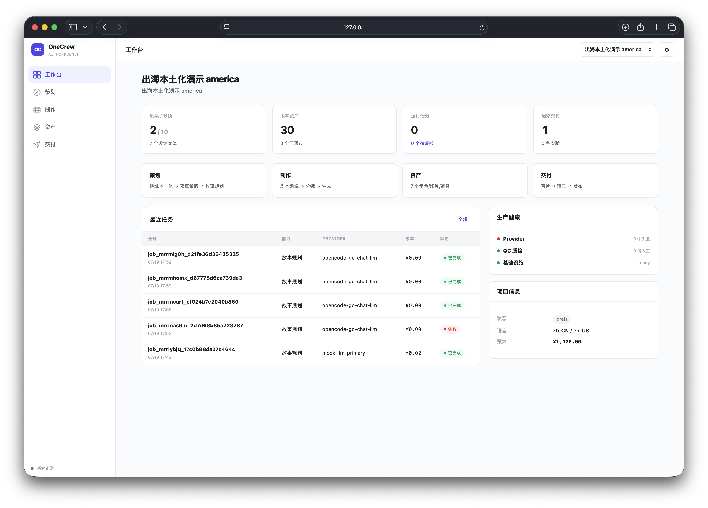
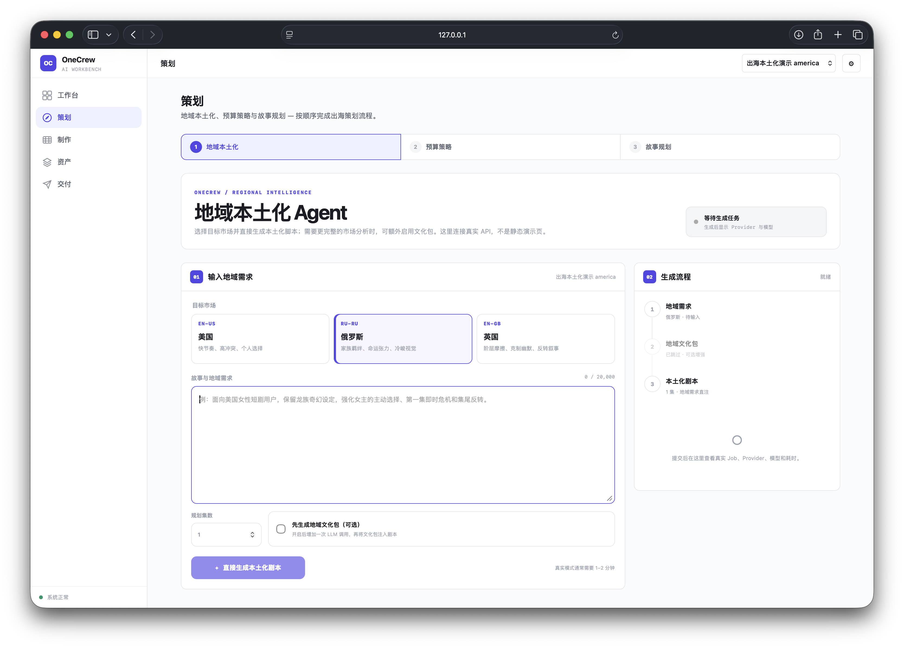
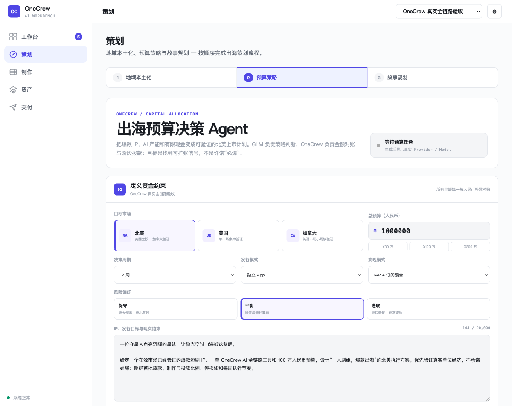
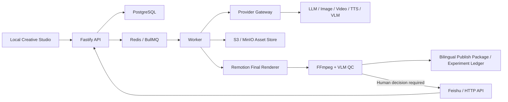

# OneCrew

[](https://github.com/qybaihe/onecrew/actions/workflows/ci.yml)
[](https://nodejs.org/)
[](https://pnpm.io/)

English · [简体中文](./README.md)

<!-- README_SYNC:0.1.0 -->

OneCrew is a Feishu-controlled, API-driven production system for bilingual Chinese and English AI short dramas and promotional media. It organizes project setup, scripts and storyboards, visual rules, media generation, asset versioning, automated quality control, localization, final rendering, human approval, and publish-package export into a recoverable and auditable pipeline.

Remotion is the only final video renderer. PostgreSQL stores business state, S3/MinIO stores controlled media, and Redis/BullMQ runs asynchronous jobs. Feishu is the only approval control plane, while the local Studio handles project browsing, asset organization, the storyboard canvas, project import, and final review.

> Current version: `0.1.0`. Stages 0–8 have been implemented and verified through a local deterministic Mock end-to-end run. On 2026-07-16, operator-supplied credentials passed minimal real smoke tests for LLM, VLM, image, video, and TTS. On 2026-07-18, a real Feishu tenant validated all six Base tables and their fields. On 2026-07-19, OneCrew added regional localization, overseas budget allocation, and the unified one-person-crew workbench, and deployed the production Landing site to EdgeOne. A complete real production E2E, live Feishu callback/card workflow, and direct platform publishing remain to be verified. Credentials are never committed and Mock results are never presented as real provider output.

[China-accessible Landing](https://onecrew-landing-hf5xmbvc.edgeone.cool/) · [Regional-localization demo](./docs/regional-localization-demo.md) · [API documentation](./docs/api.md)

## Product screenshots

### One-person crew workbench

The workbench brings projects, episodes/shots, versioned assets, running Jobs, rendered deliverables, and production health into one auditable interface.



### Regional Localization Agent

Start from a target market and story brief, then generate a localized script directly or create a regional culture pack before story planning. The UI exposes the Job, Provider, Model, duration, and Mock/Real boundary.



### Overseas Budget Decision Agent

Provide the IP, target market, total budget, decision horizon, distribution/monetization model, and risk tolerance. The Agent returns reconciled allocations, staged capital releases, channel strategy, KPI gates, a one-person operating cadence, risks, and evidence.



> These are browser captures of the current React workbench, not design mockups. Development Jobs explicitly distinguish `MOCK` output from real Provider execution.

## Available Agents and automated roles

| Agent / automated role | Problem addressed | Primary artifact | Current status |
| --- | --- | --- | --- |
| `RegionalCulturePlanner` | Adapt a story for the US, Russia, or UK before script generation | Eight groups of audience, theme, value, taboo, hook, visual-motif, language, and reference-case fields | Mock E2E verified; Real reuses the smoke-tested LLM route |
| `BudgetAllocationPlanner` | Turn a proven IP, AI capacity, and limited cash into a killable North America launch plan | Category allocation, release phases, channels, KPI gates, one-person cadence, assumptions, and risks | Contract, API, UI, Mock output, and amount reconciliation implemented |
| `CreativeStoryPlanner` | Convert a creative brief into an appendable episode plan | Episode stories, scripts, and character/scene/prop definitions, optionally driven by a culture-pack Job | Mock runtime-verified; Real uses the shared LLM Gateway |
| Generation and continuity workflow | Keep characters, settings, props, and adjacent shots consistent | Image/video versions, reference mappings, tail-frame continuity, and asset provenance | Mock browser-verified; real image/video adapters smoke-tested |
| `LocalizationOrchestrator` | Convert the Chinese master into a renderable English version | Structured translation, per-line TTS, duration-driven timing, subtitles, and Locale Pack | Local integration path verified |
| QC + Human Recovery | Catch technical defects, semantic drift, and continuity risk before release | FFmpeg metrics, VLM decision, durable human gates, and four Feishu actions | Mock/integration verified; live Feishu callback loop pending |

Regional localization, budget allocation, and story planning reuse the existing LLM Provider Gateway, and their outputs remain auditable Job artifacts. Feishu owns notification, approval, and human decisions; the OneCrew workbench owns context, assets, capital, and execution evidence.

## Features

| Area | Capability | Status |
| --- | --- | --- |
| One-person crew workbench | Five primary entries for workbench, planning, production, assets, and delivery, backed by aggregated Job, QC, render, experiment, and audit snapshots | Implemented and browser-verified on desktop/mobile |
| Regional localization | Generate a localized script directly or produce an eight-field regional culture pack before story planning | America Mock E2E verified; Russia/UK parameterized |
| Overseas budget decisions | Generate a reconciled, stage-gated plan from market, budget, horizon, distribution/monetization model, and risk tolerance | Contract, API, UI, Mock path, and unit tests implemented |
| Projects and scripts | Multiple projects and episodes, script plans, character/scene/prop libraries, and structured storyboards | Implemented |
| Story planning | Generate a requested number of episode stories, scripts, and character/scene/prop definitions from a brief; preview and atomically append | Mock runtime-verified; Real requires credentials |
| Creative Studio | Script editing, storyboard list/canvas, character/scene/prop editing, asset binding, and final review | Implemented and browser-verified |
| Multi-reference images | Split 1×2 through 3×3 composite images into controlled assets and map them explicitly to entity/shot references with `@ImageN` semantics | Implemented and runtime-verified |
| Global asset library | Search controlled character/scene/prop media across projects and create exportable project-local aliases with provenance | Implemented and runtime-verified |
| Single-shot generation | Generate images/videos from saved shots with entity references, previous-shot tail frames, continuity constraints, and asset version write-back | Mock browser-verified; Real requires credentials |
| Batch generation | Fill only missing images/videos with durable batch progress, stop, refresh, and failed-item retry controls | Mock browser-verified |
| Shot workflow groups | Select and persist reusable shot sets across episodes, restore them after reload, and fill missing outputs or regenerate the whole set | Implemented and runtime-verified |
| Continuity QC | Compile saved character, scene, prop, camera-axis, and tail-frame continuity into the existing FFmpeg/VLM/Feishu review pipeline | Implemented and browser-verified |
| Project import/export | Import structured JSON or ZIP archives with media; export portable OneCrew archives with SHA-256 integrity data | Implemented and tested |
| Concurrent editing | Optimistic episode/entity/shot versions, 409 conflict protection, and accepted-edit auditing | Implemented and tested |
| Design system | Parse Open Design / `DESIGN.md` and compile immutable Design Packs | Implemented |
| Provider Gateway | Primary/Fallback routing for LLM, VLM, image, video, and TTS providers | Mock verified; all five current Real adapters smoke-tested |
| Job system | BullMQ queues, idempotency, budget gates, retries, cancellation, and signed callbacks | Implemented and tested |
| Asset management | Source, provider, model, seed, hash, license, and parent-child version chains | Implemented and tested |
| Final rendering | Chinese/English episodes, 30s trailers, 15s vertical teasers, 6s bumpers, and motion posters; source trims are independent from composition timing | Verified locally |
| Automated QC | Pre-queue gates reject repeated media, sparse dialogue, and timeline filler; FFmpeg measures visual variation/scene changes before VLM review | Implemented and tested |
| Human recovery | Feishu `Approve / Regenerate / Switch provider / Manual` actions | Mock/integration verified |
| Localization | Structured English translation, per-line TTS, duration-driven timing, and subtitles | Implemented and tested |
| Publishing | Bilingual media manifest, Locale Packs, experiment seeds, licenses, and ZIP export | Implemented and tested |
| Experiment write-back | PostgreSQL experiment ledger; optional Feishu Base write-back | Local path verified; real Base schema validated, publish-path write-back pending |

## How it works



Production work runs as asynchronous Jobs. A client submits a request and receives a `job_id` plus a status URL. The Worker performs generation, rendering, QC, localization, and publishing. Recoverable state, idempotency records, human gates, and LangGraph checkpoints are persisted in PostgreSQL so API or Worker restarts do not discard business state.

## Requirements

- Node.js `>= 22.13.0`
- pnpm `>= 10.13.0`; the repository pins `10.13.1`
- Docker Desktop or a compatible Docker Engine with Compose
- FFmpeg and ffprobe
- macOS or Linux; CI runs on Ubuntu

On macOS, install the command-line dependencies with Homebrew:

```bash
brew install node pnpm ffmpeg
```

Install and start Docker Desktop separately.

## Quick start

Clone the repository and run the bootstrap script:

```bash
git clone https://github.com/qybaihe/onecrew.git
cd onecrew
bash scripts/bootstrap-local.sh
```

On the first run, the script:

1. creates an untracked `.env` from `.env.example`;
2. installs the locked pnpm dependencies;
3. starts PostgreSQL, Redis, and MinIO;
4. generates contracts and builds the complete workspace;
5. applies database migrations and seed data;
6. compiles the demo Design Pack and validates provider routes;
7. starts the API, Worker, and Preview app together in foreground development mode.

After startup:

| URL | Purpose |
| --- | --- |
| `http://127.0.0.1:3000/healthz` | API liveness |
| `http://127.0.0.1:3000/readyz` | PostgreSQL, Redis, and MinIO readiness |
| `http://127.0.0.1:4173/#/dashboard` | One-person crew workbench and project overview |
| `http://127.0.0.1:4173/#/planning` | Regional-localization, budget-decision, and story-planning Agents |
| `http://127.0.0.1:4174` | Local Landing site; see the [EdgeOne production deployment](https://onecrew-landing-hf5xmbvc.edgeone.cool/) for a China-accessible version |
| `http://127.0.0.1:59001` | Local MinIO administration console |

Verify the environment:

```bash
curl http://127.0.0.1:3000/healthz
curl http://127.0.0.1:3000/readyz
pnpm infra:status
```

Stop the local infrastructure with:

```bash
pnpm infra:down
```

## Using the workbench and Creative Studio

Open `http://127.0.0.1:4173/#/dashboard` for project status and pending work, use `#/planning` for regional localization, budget decisions, and story planning, then open `#/production` for the following creative tasks:

1. switch the active project in the top bar, or import a `.onecrew.zip` / compatible ZIP archive;
2. enter a creative brief and episode count under **Story Planning**. The asynchronous Job returns a preview of episode stories, scripts, and character/scene/prop definitions. Nothing changes until you click **Write to editable project**; applying is atomic and append-only, so existing episodes and definitions are never replaced;
3. choose an episode and edit its title, summary, full script, and duration in the left rail;
4. switch between the storyboard list and React Flow canvas, then select a shot;
5. edit shot action, camera language, dialogue, narration, image/video prompts, negative prompt, and continuity notes;
6. select a character, scene, or prop in the right-hand library; edit its common and type-specific fields, then bind versioned assets from the current project as references;
7. if one image contains multiple angles or designs, choose its source and shape under **Composite reference image**. The Studio uses local FFmpeg to split it into 2–9 PNG assets, writes them to MinIO, and binds them to the current definition in row-major order;
8. search the **Global asset library** by character/scene/prop name, project, or role. Reusing an item creates a deterministic alias in the current project while preserving its URI, content hash, license, and source `parentAssetId`, so the current project remains independently exportable;
9. save with the version shown in the editor. If another editor saved first, the stale update receives HTTP 409 and the Studio reloads the current server version instead of silently overwriting it;
10. after saving the shot, click **Generate storyboard image** or **Generate video**. The Studio follows the asynchronous Job; image requests preserve entity references, the previous shot's tail frame, and continuity notes, and align `@Image1` through `@Image10` with the Provider image array. Video requests prefer the newest image version for the current shot. Successful outputs enter the asset library and link to the previous version through `parentAssetId`;
11. read the visible `MOCK` or real-provider label. Mock mode is for local development and does not create real media. Real generation requires provider credentials and the current price parameters (subscription-quota or free routes may use `0`). Jobs that exceed the project budget enter the human gate instead of spending past the limit;
12. select shots with the checkbox beside each card, name the set under **Shot workflow groups**, and save it. Groups are durable PostgreSQL records and return after a reload or restart. **Fill missing outputs** skips existing assets, while **Regenerate whole group** creates a new batch; both reuse the existing Provider, budget gate, BullMQ Jobs, and asset-version chain;
13. use **Fill missing storyboard images/videos** to process every shot without the corresponding asset. Batch records live in PostgreSQL, so the latest progress returns after a page reload. You can stop unfinished Jobs or retry only failed/cancelled items;
14. click **Run continuity QC** for an image or video already materialized in controlled MinIO/S3. OneCrew derives character identity, clothing, scene, prop, lighting, camera-axis, previous-tail-frame, and temporal-stability checks from the saved shot, then reuses the existing technical QC, VLM, and Feishu human gate. Mock placeholder URIs are never presented as checked media;
15. click **Export OneCrew Project** to download a complete, re-importable ZIP containing the project, episodes, entities, shots, frame prompts, versioned asset metadata, media, and a SHA-256 for every media file.

The Studio edits content and assets only. Approval, provider switching, and manual handoff still enter through the Feishu control plane so there is only one release-authority path.

## Split-process development

For a production-like local workflow, prepare infrastructure and data first:

```bash
cp .env.example .env
pnpm install
pnpm infra:up
pnpm contracts:generate
pnpm build
pnpm db:migrate
pnpm db:seed
pnpm design:compile
```

Then use three terminals:

```bash
# Terminal 1: API
pnpm start:api

# Terminal 2: Worker
pnpm start:worker

# Terminal 3: Creative Studio and review app
pnpm preview:dev
```

Media rendering can use significant memory. For a low-resource local demo, cap the Final output dimension:

```bash
REMOTION_FINAL_MAX_DIMENSION=640 pnpm start:worker
```

Leave this variable empty for production delivery so Final renders use the dimensions declared by the Manifest.

## Run the complete Mock E2E

`PROVIDER_MODE=mock` is the default and never calls billable external APIs. Once the API and Worker are ready, run:

```bash
pnpm demo:mock-e2e
```

The command uses the real HTTP API and an independent Worker to complete:

- one LLM script-plan Job;
- ten image Jobs and ten video Jobs;
- Chinese TTS, structured English translation, and English TTS;
- Chinese and English episodes plus eight bilingual promotional videos;
- FFmpeg technical QC and Mock VLM semantic QC;
- Chinese and English static posters;
- a publish ZIP and twelve experiment records;
- idempotency and cache verification on a same-version rerun.

Local output is written to `outputs/stage8-mock-e2e/`. This directory contains reproducible runtime evidence and is intentionally excluded from Git.

See [docs/demo.md](./docs/demo.md) for the complete walkthrough and [docs/verification/stage-8.md](./docs/verification/stage-8.md) for the latest verification evidence.

## API overview

The local API base URL is `http://127.0.0.1:3000`.

| Purpose | Endpoint |
| --- | --- |
| Health | `GET /healthz`, `GET /readyz` |
| Workbench snapshot | `GET /v1/workbench/snapshot?projectId=...` |
| Creative projects | `GET /v1/creative/projects`, `GET /v1/creative/projects/:projectId` |
| Regional culture pack | `POST /v1/creative/projects/:projectId/regional-culture-packs`; `GET .../regional-culture-packs/:jobId` |
| Overseas budget plan | `POST /v1/creative/projects/:projectId/budget-allocation-plans`; `GET .../budget-allocation-plans/:jobId` |
| Story planning | `POST /v1/creative/projects/:projectId/story-plans` to generate; `GET .../story-plans/:jobId` to preview; `POST .../story-plans/:jobId/apply` to append |
| Script/shot editing | `PATCH /v1/creative/episodes/:episodeId`, `PATCH /v1/creative/shots/:shotId` |
| Composite-reference splitting | `POST /v1/creative/entities/:entityId/reference-grids` |
| Global asset search/reuse | `GET /v1/creative/reusable-assets`; `POST /v1/creative/entities/:entityId/reusable-assets` |
| Single-shot image/video generation | `POST /v1/creative/shots/:shotId/generations` |
| Batch generation | `POST /v1/creative/projects/:projectId/generation-batches`; query/stop/retry under `/v1/creative/generation-batches/:batchId/...` |
| Shot workflow groups | `GET/POST /v1/creative/projects/:projectId/workflow-groups`; `POST /v1/creative/workflow-groups/:groupId/run` |
| Per-shot continuity QC | `POST /v1/creative/shots/:shotId/continuity-qc`; read status through `GET /v1/qc/runs/:qcRunId` |
| Project import | `POST /v1/creative/imports/...` for structured JSON, OneCrew ZIP, and compatible ZIP archives |
| Project export | `GET /v1/creative/projects/:projectId/exports/onecrew.zip` |
| Script plan | `POST /v1/projects/:projectId/plan` |
| Image generation | `POST /v1/images/generate` |
| Video generation | `POST /v1/shots/generate` |
| Speech synthesis | `POST /v1/audio/synthesize` |
| Job status/cancel | `GET /v1/jobs/:jobId`, `POST /v1/jobs/:jobId/cancel` |
| Provider callback | `POST /v1/providers/callback` |
| Remotion render | `POST /v1/renders`, `GET /v1/renders/:renderId` |
| Automated QC | `POST /v1/qc/run`, `GET /v1/qc/runs/:qcRunId` |
| Localization | `POST /v1/localizations` |
| Publish package | `POST /v1/publishes` |
| Experiment ledger | `GET /v1/projects/:projectId/experiments` |
| Feishu events | `POST /v1/feishu/events`, `POST /v1/feishu/card-actions` |

Write endpoints require `Content-Type: application/json` and a non-empty `Idempotency-Key`. Asynchronous submissions return HTTP 202 plus a status URL. Reusing the same key with an identical request replays the existing Job; reusing it with a different request returns 409.

Request and response examples are documented in [docs/api.md](./docs/api.md).

## Configuration

Every environment variable is documented in [.env.example](./.env.example). Never commit a real `.env` file.

### Local infrastructure

| Variable | Default | Purpose |
| --- | --- | --- |
| `DATABASE_URL` | Local PostgreSQL on `55432` | Business state, Jobs, assets, experiments |
| `REDIS_URL` | Local Redis on `56379` | BullMQ queues |
| `S3_ENDPOINT` | Local MinIO on `59000` | Controlled media storage |
| `S3_BUCKET` | `onecrew` | Media bucket |
| `FFMPEG_PATH` | `ffmpeg` | Technical QC and media processing |
| `FFPROBE_PATH` | `ffprobe` | Media probing |

### Provider mode

```dotenv
PROVIDER_MODE=mock
```

Mock mode is intended for development, CI, and demonstrations. Before switching to `real`, configure the relevant API keys, model IDs, callback secret, and current pricing values. Missing required configuration fails closed and never silently falls back to Mock.

Current real Provider Profile:

```dotenv
PROVIDER_MODE=real
PROVIDER_PROFILE=opencode-agnes-mimo
```

Real provider variables:

- LLM: `OPENCODE_GO_API_KEY`, `OPENCODE_GO_LLM_MODEL=glm-5.2`
- VLM: the same key and `OPENCODE_GO_VLM_MODEL=minimax-m3`
- Image/video: `AGNES_API_KEY`, `AGNES_IMAGE_MODEL=agnes-image-2.1-flash`, `AGNES_VIDEO_MODEL=agnes-video-v2.0`
- TTS: `MIMO_API_KEY`, `MIMO_TTS_MODEL=mimo-v2.5-tts`, and the Chinese/English voice lists
- Signed callbacks: `PROVIDER_CALLBACK_SECRET`

Marginal costs may remain `0` while requests use the OpenCode Go subscription quota, current free Agnes pricing, and MiMo's limited-free period. Update the CNY unit-price variables before enabling Zen balance fallback or after a provider resumes billing. The legacy OpenAI + Volcengine + ElevenLabs Profile remains available as an optional compatibility path.

Validate the configuration with:

```bash
pnpm providers:check
pnpm providers:smoke-real
```

`providers:check` validates configuration and routing without external requests. `providers:smoke-real` submits five minimal real requests and can consume subscription quota or incur charges.

See [docs/provider-setup.md](./docs/provider-setup.md) for details.

### Feishu

A real Feishu environment requires a custom app, an authorized Base, and the following variables:

- `FEISHU_APP_ID`
- `FEISHU_APP_SECRET`
- `FEISHU_BASE_APP_TOKEN`
- `FEISHU_VERIFICATION_TOKEN`
- `FEISHU_ENCRYPT_KEY`
- `FEISHU_ALLOWED_OPEN_IDS`

After configuration, run:

```bash
pnpm feishu:setup
```

Table definitions, minimum permissions, event subscriptions, and callback security are covered in [docs/feishu-setup.md](./docs/feishu-setup.md).

## Development commands

| Command | Purpose |
| --- | --- |
| `pnpm dev` | Run every workspace with a dev task in parallel |
| `pnpm start:api` | Start the API process |
| `pnpm start:worker` | Start the asynchronous Worker |
| `pnpm preview:dev` | Start the one-person crew workbench, planning Agents, storyboard canvas, and review app |
| `pnpm remotion:studio` | Open Remotion Studio |
| `pnpm remotion:demo` | Render the fixed demo Compositions |
| `pnpm remotion:final-smoke` | Run the Final-render smoke test |
| `pnpm remotion:pipeline-smoke -- <projectId> <shotId>` | Run an isolated 1–15 second real single-shot pipeline smoke; it can never masquerade as an episode |
| `pnpm remotion:real-project-e2e -- <projectId> <episodeId>` | Build bilingual masters and a release package only when the complete episode has sufficient distinct shot media, dialogue, and passing QC |
| `pnpm demo:mock-e2e` | Run the complete Mock production loop |
| `pnpm landing:deploy:edgeone` | Build the Landing site with relative assets and deploy it to the linked EdgeOne Makers project; requires an authenticated CLI or Token |
| `pnpm contracts:generate` | Regenerate JSON Schemas |
| `pnpm db:generate` | Generate a Drizzle migration |
| `pnpm db:check` | Validate schema and migration state |
| `pnpm db:migrate` | Apply database migrations |
| `pnpm db:seed` | Insert idempotent demo data |
| `pnpm design:compile` | Compile the demo Design Pack |
| `pnpm providers:check` | Validate the Provider Profile, credential completeness, and routes without printing secrets |
| `pnpm providers:smoke-real` | Submit the five minimal real Provider smoke tests |
| `pnpm lint` | Run ESLint |
| `pnpm typecheck` | Type-check the complete workspace |
| `pnpm test:unit` | Run unit tests |
| `pnpm test:integration` | Run tests using PostgreSQL, Redis, and MinIO |
| `pnpm build` | Build all 18 packages/apps |
| `pnpm readme:check` | Verify bilingual README synchronization and critical commands |

Recommended pre-commit checks:

```bash
pnpm readme:check
pnpm lint
pnpm typecheck
pnpm test:unit
pnpm test:integration
pnpm build
```

## Repository layout

```text
apps/
  api/                 Fastify API, health checks, and HTTP routes
  worker/              BullMQ consumers for generation/render/QC/publishing
  remotion/            Compositions, components, Player, and Final Renderer
  preview/             React one-person crew workbench, decision Agents, storyboard canvas, and Remotion review UI
  landing/             Brand and team site with GitHub Pages and EdgeOne Makers builds
packages/
  config/              Zod environment contract
  contracts/           Shared contracts and JSON Schemas
  creative/            Creative domain model, project import/export, media materialization
  domain/              State machines, versions, and input hashes
  db/                  Drizzle schema, migrations, seed, repositories
  design-adapter/      Open Design parsing and Design Pack compilation
  providers/           Mock/Real provider adapters and routing
  media/               S3/MinIO media-write boundary
  feishu/              Base, cards, events, and four actions
  localization/        Chinese/English Locale Packs and TTS timing
  publishing/          Publish ZIP and experiment seeds
  qc/                  FFmpeg/VLM quality control
  workflows/           Jobs, budgets, recovery, and LangGraph orchestration
design-packs/           Reproducible design inputs and license manifests
infra/                  Local Docker Compose stack
scripts/                Bootstrap, verification, and maintenance scripts
docs/                   API, operations, configuration, and verification docs
```

## Data and asset rules

- PostgreSQL is the source of truth for business state; MinIO/S3 is the source of truth for media; Redis only carries queues.
- Every media-generation Job creates or reuses an `AssetRecord`.
- Asset records include source, provider, model, seed, content hash, and license.
- Cached Jobs reuse the original asset ID. Regeneration creates a new version connected to the previous version through `parentAssetId`.
- Feishu stores control data and controlled links, not large media files.
- Episode, character/scene/prop, and shot edits use optimistic versions; accepted changes and the actor are written to the audit log.
- OneCrew project ZIPs preserve the full creative contract and media. Import rejects traversal, duplicate or undeclared entries, expansion-limit violations, and media hash mismatches.
- The Studio can organize creative data and media, but it does not expose approval, release, or provider-switch actions. Those actions enter only through the Feishu control plane.

## Tests and current completion

Latest repository regression (2026-07-19):

- lint and build passed across all 18 workspaces, with 32 typecheck tasks passing;
- the regional-localization, budget-decision, and workbench-snapshot contracts, APIs, Provider routes, Mock outputs, and React pages passed lint, typecheck, unit tests, and build;
- the Landing site was deployed through an EdgeOne Makers production direct upload; its public root, static assets, mobile layout, and GitHub links were verified online;
- 106 unit tests passed;
- 43 integration tests passed;
- PostgreSQL, Redis, and MinIO were healthy; all fields in the six real Feishu Base tables (`Project / Shot / Asset / Generation Job / QC / Overseas Experiment`) validated without creating or changing fields;
- a fresh database applied 10 migrations and produced 23 business tables plus 10 demo shots;
- JSON and ZIP project imports passed API smoke tests; ZIP media was written to local MinIO and bound to versioned assets; a OneCrew export containing three real MinIO assets passed browser-download and ZIP-integrity checks;
- story planning ran through the local Mock Worker: a two-episode structured plan plus character/scene/prop definitions was previewed and appended in one transaction, project version advanced from v1 to v2, same-Job replay remained idempotent, and stale versions returned 409;
- a 2×2 composite image was split by real local FFmpeg into four PNG files, stored in MinIO, and atomically bound to character v2; the same idempotency key replayed without adding asset records, and the next image Job received seven ordered references plus aligned `@ImageN` semantic mappings;
- the global library ran across two real database projects: search returned origin project/entity metadata and a controlled MinIO URI, reuse advanced the target character to v2, and its project-local alias preserved the original URI, SHA-256, and `parentAssetId`; same-key replay remained idempotent;
- shot workflow groups ran against the real database and browser: a selected group remained after reload, a missing-only run skipped an existing image, and a forced rerun created a new batch that entered the existing Feishu human gate when the project budget was insufficient;
- the Creative Studio was verified at desktop and `390 × 844` mobile viewports, including story-plan preview/apply, project switching, script/shot saves, character/scene/prop editing, composite-reference splitting and binding, global asset search/reuse, shot workflow groups, versioned-asset binding, single-shot and batch image/video generation, durable batch recovery/stop/retry, continuity QC, version-chain write-back, version conflicts, canvas, export, and final review, with no errors or warnings in a clean browser session;
- all 10 Final MP4 files were H.264/AAC at 30 fps;
- the general QC suite passed all 15 technical checks and its Mock VLM decision; per-shot continuity QC also passed a full run against a decodable MinIO image, while an invalid input was verified to open the durable human gate;
- the publish ZIP passed integrity checks for 14 entries, including eight bilingual promotional videos and twelve experiment seeds.

CI is defined in [.github/workflows/ci.yml](./.github/workflows/ci.yml). Every push and pull request starts infrastructure from `.env.example` and runs the complete verification suite.

## Troubleshooting

### `/readyz` returns 503

```bash
pnpm infra:status
pnpm infra:logs
```

Confirm Docker is running and PostgreSQL, Redis, and MinIO are healthy.

### A Job remains `queued`

Confirm that the independent Worker is running and has logged `onecrew_worker_ready`:

```bash
pnpm start:worker
```

### Real provider mode fails during startup

```bash
pnpm providers:check
```

Real mode requires complete credentials, model IDs, a callback secret, and pricing configuration. Missing values fail by design.

### Remotion uses too many local resources

For local demonstrations, run:

```bash
REMOTION_FINAL_MAX_DIMENSION=640 pnpm start:worker
```

Keep `RENDER_QUEUE_CONCURRENCY=1`. Do not use the dimension cap for production delivery.

### Reusing an idempotency key returns 409

One idempotency key represents exactly one request. Use a new key after changing the request body; do not overwrite an existing Job.

More recovery procedures are available in [docs/operations.md](./docs/operations.md).

## Security and honest boundaries

- `.env`, runtime output, dependencies, browser traces, and local media are excluded from Git.
- API logs redact Authorization, API keys, tokens, secrets, passwords, and cookies.
- Provider callbacks use timestamped HMAC-SHA256 signatures and reject replayed or modified payloads.
- `PROVIDER_MODE=real` fails closed on incomplete configuration.
- OpenCode Go `glm-5.2`, `minimax-m3`, Agnes Image 2.1 Flash, Agnes Video V2.0, and MiMo V2.5 TTS were live-tested on 2026-07-16; the six real Feishu Base tables were validated on 2026-07-18, while the live callback challenge, card delivery, and four-action workflow remain to be verified.
- The currently audited delivery path is ZIP export; direct platform publishing is not claimed as available.
- Mock media carries a visible `MOCK · shot_id` label.

## Keeping the README current

The Chinese `README.md` and English `README.en.md` are the project entry points. Future changes must follow these rules:

1. update both READMEs when startup commands are added, removed, or renamed;
2. update the matching sections when environment variables, ports, APIs, directories, or capability status change;
3. update the `README_SYNC` marker in both files when the package version changes;
4. complete the README checklist in every pull request;
5. keep `pnpm readme:check` in CI so language links, versions, and critical commands cannot silently drift.

Detailed design and operational references live under [`docs/`](./docs/). The README only describes current facts needed to start, develop, and verify the project.

## Documentation

- [API usage](./docs/api.md)
- [Local operations](./docs/operations.md)
- [Complete Mock demo](./docs/demo.md)
- [Feishu setup](./docs/feishu-setup.md)
- [Provider setup](./docs/provider-setup.md)
- [Regional Localization Agent demo](./docs/regional-localization-demo.md)
- [Design Packs](./docs/design-pack.md)
- [Remotion rendering](./docs/remotion.md)
- [Automated QC](./docs/qc.md)
- [Localization and publishing](./docs/localization-publishing.md)
- [Dependencies and licenses](./docs/dependency-licenses.md)
- [Verification records](./docs/verification/)
