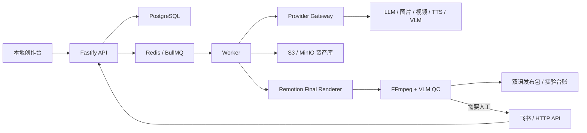

# 星轨 OneCrew

[](https://github.com/qybaihe/onecrew/actions/workflows/ci.yml)
[](https://nodejs.org/)
[](https://pnpm.io/)

[English](./README.en.md) · 简体中文

<!-- README_SYNC:0.1.0 -->

OneCrew 是一个由飞书控制、API 驱动的中英双语 AI 短剧生产与宣传系统。它把项目立项、剧本与分镜、视觉规范、媒体生成、资产版本、自动质检、双语本地化、正式渲染、人工审批和发布包输出组织成一条可恢复、可审计的生产流水线。

正式视频统一由 Remotion 渲染。项目业务状态保存在 PostgreSQL，媒体保存在 S3/MinIO，Redis/BullMQ 负责异步任务；飞书是唯一审批控制面，本地创作台负责工程浏览、素材组织、分镜画布、工程导入和成片审阅。

> 当前版本：`0.1.0`。阶段 0～8 已完成本地实现和 Mock 端到端验证。真实模型、真实飞书租户和平台直发需要使用者自己的凭证与授权，仓库不会把 Mock 结果描述成真实厂商结果。

## 主要功能

| 模块 | 能力 | 当前状态 |
| --- | --- | --- |
| 项目与剧本 | 多项目、多剧集、剧本计划、角色/场景/道具库和结构化分镜 | 已实现 |
| 故事规划 | 从创作简报生成指定集数的剧情、剧本与角色/场景/道具设定；预览后原子追加 | Mock 实操验证；Real 需凭证 |
| 创作工作台 | 剧本编辑、分镜列表/画布、角色/场景/道具编辑、资产绑定和成片审阅 | 已实现并实操验证 |
| 单镜生成 | 从已保存分镜生成图片/视频，自动带入实体参考、上一镜尾帧与连续性约束，结果进入资产版本链 | Mock 实操验证；Real 需凭证 |
| 批量生成 | 仅补齐缺失图片/视频，持久化批次进度，支持停止、刷新和失败项重试 | Mock 实操验证 |
| 连续性 QC | 从已保存分镜自动编译角色、场景、道具、轴线与尾帧衔接检查，复用 FFmpeg/VLM/飞书人工闸门 | 已实现并实操验证 |
| 工程导入导出 | 导入结构化 JSON 或含媒体的 ZIP；导出带 SHA-256 完整性校验的 OneCrew 工程包 | 已实现并测试 |
| 并发编辑 | 剧集/素材设定/分镜乐观版本、409 冲突防护、成功编辑审计 | 已实现并测试 |
| 设计系统 | 解析 Open Design / `DESIGN.md`，编译不可变 Design Pack | 已实现 |
| Provider Gateway | LLM、VLM、图片、视频、TTS 的 Primary/Fallback 路由 | Mock 已实测；Real Adapter 已实现 |
| 任务系统 | BullMQ 队列、幂等键、预算闸门、重试、取消、回调签名 | 已实现并测试 |
| 资产管理 | 来源、Provider、模型、种子、哈希、许可证和父子版本链 | 已实现并测试 |
| 正片渲染 | 中英文正片、30 秒预告、15 秒竖版、6 秒广告、动态海报 | 已实测 |
| 自动质检 | FFmpeg/ffprobe 技术检查、VLM 语义检查、一次自动修复 | 已实现并测试 |
| 人工恢复 | 飞书 `通过 / 重生成 / 切换模型 / 转人工` 四动作 | Mock/集成测试通过 |
| 本地化 | 英文结构化翻译、逐句 TTS、时长驱动时间线和字幕 | 已实现并测试 |
| 发布 | 双语媒体清单、Locale Pack、实验种子、许可证和 ZIP | 已实现并测试 |
| 实验回写 | PostgreSQL 实验台账；有凭证时可写入飞书 Base | 本地已实测；真实飞书待授权 |

## 系统如何工作



生产过程采用异步 Job。客户端提交任务后得到 `job_id` 和状态地址；Worker 执行生成、渲染、质检与发布。所有可恢复状态、幂等记录、人工闸门和 LangGraph checkpoint 都写入 PostgreSQL，重启 API 或 Worker 不会丢失业务状态。

## 环境要求

- Node.js `>= 22.13.0`
- pnpm `>= 10.13.0`，仓库锁定版本为 `10.13.1`
- Docker Desktop 或兼容的 Docker Engine + Compose
- FFmpeg 与 ffprobe
- macOS 或 Linux；CI 使用 Ubuntu

macOS 可以使用 Homebrew 安装基础工具：

```bash
brew install node pnpm ffmpeg
```

Docker Desktop 需要单独安装并启动。

## 快速启动

克隆仓库后执行：

```bash
git clone https://github.com/qybaihe/onecrew.git
cd onecrew
bash scripts/bootstrap-local.sh
```

首次启动脚本会：

1. 从 `.env.example` 创建未被 Git 跟踪的 `.env`；
2. 安装 pnpm 锁定依赖；
3. 启动 PostgreSQL、Redis 和 MinIO；
4. 生成契约并构建全部 workspace；
5. 执行数据库 migration 和 seed；
6. 编译示例 Design Pack 并检查 Provider 路由；
7. 以前台开发模式同时运行 API、Worker 和 Preview。

启动完成后访问：

| 地址 | 用途 |
| --- | --- |
| `http://127.0.0.1:3000/healthz` | API 进程存活检查 |
| `http://127.0.0.1:3000/readyz` | PostgreSQL、Redis、MinIO 就绪检查 |
| `http://127.0.0.1:4173` | 创作台、分镜画布和 Remotion Player 审片页 |
| `http://127.0.0.1:59001` | MinIO 本地管理控制台 |

验证服务：

```bash
curl http://127.0.0.1:3000/healthz
curl http://127.0.0.1:3000/readyz
pnpm infra:status
```

停止本地基础设施：

```bash
pnpm infra:down
```

## 使用创作台

打开 `http://127.0.0.1:4173/#studio` 后，可以直接完成以下工作：

1. 在顶部切换当前项目，或导入 `.onecrew.zip` / 兼容 ZIP 工程；
2. 在“故事规划”填写创作简报与新增集数。异步 Job 会返回可预览的分集剧情、剧本、角色、场景和道具设定；只有点击“写入可编辑工程”才会原子追加，已有剧集与设定不会被替换；
3. 在左侧选择剧集，编辑标题、概要、完整剧本和剧集时长；
4. 在分镜列表与 React Flow 画布之间切换，选择要编辑的镜头；
5. 修改分镜动作、镜头语言、对白、旁白、图像/视频提示词、负向提示词和连续性备注；
6. 在右侧素材库选择角色、场景或道具，编辑名称、描述、提示词和类型专属设定，并把当前项目的版本资产勾选为参考素材；
7. 保存时界面会携带当前版本。如果其他编辑者已先保存，过期修改会收到 HTTP 409，界面随即重新读取最新内容，不会静默覆盖；
8. 分镜保存后点击“生成分镜图”或“生成视频”。创作台会跟踪异步 Job，图片会保留实体参考、上一镜尾帧和连续性备注；视频优先使用该镜头最新的图片版本。成功结果自动写入素材库并用 `parentAssetId` 连接前一版；
9. 界面会显示 `MOCK` 或真实 Provider。Mock 用于本地开发，不产生真实媒体；真实生成需先配置 Provider 凭证和正价格。超出项目预算时 Job 进入人工闸门，不会绕过预算继续扣费；
10. 使用分镜区上方的“批量补齐分镜图/视频”只处理尚无对应资产的镜头。批次记录保存在 PostgreSQL，刷新页面仍能恢复最新进度；可停止未完成 Job，也可只重试失败或已取消项；
11. 对已写入受控 MinIO/S3 的图片或视频点击“运行连续性 QC”。系统会从当前保存版本自动生成角色身份、服装、场景、道具、光照、镜头轴线、上一镜尾帧与视频稳定性检查项，再交给现有技术 QC、VLM 与飞书人工闸门；Mock 占位 URI 不会被冒充为可检查媒体；
12. 点击“导出 OneCrew 工程”下载可再导入的完整 ZIP。包内含项目、剧集、素材实体、分镜、帧提示词、版本化资产和每个媒体文件的 SHA-256。

创作台只负责内容与素材编辑。审批、模型切换和转人工仍从飞书控制面进入，避免出现两套互相冲突的放行逻辑。

## 分进程开发

需要更接近生产的调试方式时，先准备基础设施和数据：

```bash
cp .env.example .env
pnpm install
pnpm infra:up
pnpm contracts:generate
pnpm build
pnpm db:migrate
pnpm db:seed
pnpm design:compile
```

然后使用三个终端：

```bash
# 终端 1：API
pnpm start:api

# 终端 2：Worker
pnpm start:worker

# 终端 3：创作台与审片页
pnpm preview:dev
```

媒体渲染会占用较多内存。低资源本地演示可以限制 Final 输出尺寸：

```bash
REMOTION_FINAL_MAX_DIMENSION=640 pnpm start:worker
```

生产交付应留空该变量，让 Final 按 Manifest 的正式分辨率渲染。

## 运行完整 Mock E2E

默认 `PROVIDER_MODE=mock`，不会调用外部计费接口。API 与 Worker ready 后执行：

```bash
pnpm demo:mock-e2e
```

该命令会通过真实 HTTP API 和独立 Worker 完成：

- 1 个 LLM 剧本计划 Job；
- 10 个图片 Job、10 个视频 Job；
- 中文 TTS、英文结构化翻译与英文 TTS；
- 中英文正片和 8 支双语宣传片；
- FFmpeg 技术 QC 与 Mock VLM 语义 QC；
- 中英文静态海报；
- 发布 ZIP 和 12 条实验记录；
- 相同版本重跑时的幂等与缓存验证。

输出保存在本地 `outputs/stage8-mock-e2e/`。该目录属于可再生成的运行证据，不提交到 Git。

完整演示说明见 [docs/demo.md](./docs/demo.md)，最近一次验证证据见 [docs/verification/stage-8.md](./docs/verification/stage-8.md)。

## API 概览

本地 API 基址为 `http://127.0.0.1:3000`。

| 功能 | 端点 |
| --- | --- |
| 健康检查 | `GET /healthz`、`GET /readyz` |
| 创作项目 | `GET /v1/creative/projects`、`GET /v1/creative/projects/:projectId` |
| 故事规划 | `POST /v1/creative/projects/:projectId/story-plans`生成；`GET .../story-plans/:jobId`预览；`POST .../story-plans/:jobId/apply`追加 |
| 剧本/分镜编辑 | `PATCH /v1/creative/episodes/:episodeId`、`PATCH /v1/creative/shots/:shotId` |
| 单镜图片/视频生成 | `POST /v1/creative/shots/:shotId/generations` |
| 批量生成 | `POST /v1/creative/projects/:projectId/generation-batches`；批次查询/停止/重试位于 `/v1/creative/generation-batches/:batchId/...` |
| 单镜连续性 QC | `POST /v1/creative/shots/:shotId/continuity-qc`；状态读取复用 `GET /v1/qc/runs/:qcRunId` |
| 工程导入 | `POST /v1/creative/imports/...`，支持结构化 JSON、OneCrew ZIP 与兼容 ZIP |
| 工程导出 | `GET /v1/creative/projects/:projectId/exports/onecrew.zip` |
| 剧本计划 | `POST /v1/projects/:projectId/plan` |
| 图片生成 | `POST /v1/images/generate` |
| 视频生成 | `POST /v1/shots/generate` |
| 配音生成 | `POST /v1/audio/synthesize` |
| Job 查询/取消 | `GET /v1/jobs/:jobId`、`POST /v1/jobs/:jobId/cancel` |
| Provider 回调 | `POST /v1/providers/callback` |
| Remotion 渲染 | `POST /v1/renders`、`GET /v1/renders/:renderId` |
| 自动质检 | `POST /v1/qc/run`、`GET /v1/qc/runs/:qcRunId` |
| 双语本地化 | `POST /v1/localizations` |
| 发布包 | `POST /v1/publishes` |
| 实验台账 | `GET /v1/projects/:projectId/experiments` |
| 飞书事件 | `POST /v1/feishu/events`、`POST /v1/feishu/card-actions` |

写入类端点使用 `Content-Type: application/json` 和非空 `Idempotency-Key`。异步提交返回 HTTP 202 与状态 URL；复用相同幂等键和相同请求会返回原任务，复用同一键但改变请求会返回 409。

请求与响应示例见 [docs/api.md](./docs/api.md)。

## 配置

所有环境变量都在 [.env.example](./.env.example) 中说明。不要把真实 `.env` 提交到仓库。

### 本地基础设施

| 变量 | 默认值 | 说明 |
| --- | --- | --- |
| `DATABASE_URL` | 本地 PostgreSQL `55432` | 业务状态、Job、资产和实验台账 |
| `REDIS_URL` | 本地 Redis `56379` | BullMQ 队列 |
| `S3_ENDPOINT` | 本地 MinIO `59000` | 受控媒体存储 |
| `S3_BUCKET` | `onecrew` | 媒体 bucket |
| `FFMPEG_PATH` | `ffmpeg` | 技术质检与媒体处理 |
| `FFPROBE_PATH` | `ffprobe` | 媒体探测 |

### Provider 模式

```dotenv
PROVIDER_MODE=mock
```

Mock 是默认值，适合开发、CI 和演示。切换到 `real` 前必须配置对应 API Key、模型 ID、回调密钥和正价格；缺项会失败关闭，不会静默退回 Mock。

真实能力对应变量：

- LLM/VLM：`OPENAI_API_KEY`、`OPENAI_MODEL`、`OPENAI_VLM_MODEL`
- 图片/视频：`VOLCENGINE_ARK_API_KEY`、`SEEDREAM_MODEL`、`SEEDANCE_MODEL`
- TTS：`ELEVENLABS_API_KEY`、`ELEVENLABS_MODEL`
- 安全回调：`PROVIDER_CALLBACK_SECRET`

配置完成后运行：

```bash
pnpm providers:check
```

详细说明见 [docs/provider-setup.md](./docs/provider-setup.md)。

### 飞书

真实飞书环境需要创建自建应用、授权 Base，并设置：

- `FEISHU_APP_ID`
- `FEISHU_APP_SECRET`
- `FEISHU_BASE_APP_TOKEN`
- `FEISHU_VERIFICATION_TOKEN`
- `FEISHU_ENCRYPT_KEY`
- `FEISHU_ALLOWED_OPEN_IDS`

配置后执行：

```bash
pnpm feishu:setup
```

表结构、最小权限、事件订阅与回调安全说明见 [docs/feishu-setup.md](./docs/feishu-setup.md)。

## 常用开发命令

| 命令 | 作用 |
| --- | --- |
| `pnpm dev` | 并行启动所有支持 dev 的 workspace |
| `pnpm start:api` | 启动 API 进程 |
| `pnpm start:worker` | 启动异步 Worker |
| `pnpm preview:dev` | 启动创作台、分镜画布和审片页 |
| `pnpm remotion:studio` | 打开 Remotion Studio |
| `pnpm remotion:demo` | 渲染固定示例 Composition |
| `pnpm remotion:final-smoke` | 运行 Final 渲染烟雾测试 |
| `pnpm demo:mock-e2e` | 运行完整 Mock 生产闭环 |
| `pnpm contracts:generate` | 重新生成 JSON Schema |
| `pnpm db:generate` | 生成 Drizzle migration |
| `pnpm db:check` | 检查 schema 与 migration |
| `pnpm db:migrate` | 应用数据库 migration |
| `pnpm db:seed` | 写入可重复运行的演示数据 |
| `pnpm design:compile` | 编译示例 Design Pack |
| `pnpm lint` | ESLint 检查 |
| `pnpm typecheck` | TypeScript 全仓检查 |
| `pnpm test:unit` | 运行单元测试 |
| `pnpm test:integration` | 运行依赖 PostgreSQL/Redis/MinIO 的集成测试 |
| `pnpm build` | 构建全部 17 个 package/app |
| `pnpm readme:check` | 检查中英文 README 是否同步且关键命令存在 |

推荐提交前运行：

```bash
pnpm readme:check
pnpm lint
pnpm typecheck
pnpm test:unit
pnpm test:integration
pnpm build
```

## 仓库结构

```text
apps/
  api/                 Fastify API、健康检查和 HTTP 路由
  worker/              BullMQ Worker、生成/渲染/QC/发布消费者
  remotion/            Composition、组件、Player 与唯一 Final Renderer
  preview/             React 创作台、分镜画布与 Remotion 审片页
packages/
  config/              Zod 环境变量契约
  contracts/           共享契约与 JSON Schema
  creative/            创作领域模型、工程导入/导出与媒体物化
  domain/              状态机、版本和输入哈希
  db/                  Drizzle schema、migration、seed、repository
  design-adapter/      Open Design 解析与 Design Pack 编译
  providers/           Mock/Real Provider Adapter 与路由
  media/               S3/MinIO 媒体写入边界
  feishu/              Base、卡片、事件和四动作
  localization/        中英 Locale Pack、TTS 时间线
  publishing/          发布 ZIP 与实验种子
  qc/                  FFmpeg/VLM 质检
  workflows/           Job、预算、恢复与 LangGraph 编排
design-packs/           可重复编译的设计输入和许可证清单
infra/                  本地 Docker Compose
scripts/                启动、验证和维护脚本
docs/                   API、运维、配置、验证与设计文档
```

## 数据与资产规则

- PostgreSQL 是业务状态真相；MinIO/S3 是媒体真相；Redis 仅作为队列。
- 每个媒体生成 Job 都会创建或复用 `AssetRecord`。
- 资产记录来源、Provider、模型、seed、内容哈希和许可证。
- 缓存任务复用原资产 ID；重生成创建新版本，并通过 `parentAssetId` 连接前一版。
- 飞书只保存控制信息和受控链接，不承担大文件存储。
- 剧本、角色/场景/道具和分镜编辑使用乐观版本，成功变更与操作人会写入审计日志。
- OneCrew 工程 ZIP 保存完整创作契约与媒体；导入前会拒绝路径穿越、重复/未声明文件、超限解压和哈希不匹配。
- 创作台可以组织创作数据与媒体，但不提供审批、放行或网页模型切换；这些动作只通过飞书控制面进入。

## 测试与当前完成度

最近一次完整本地回归（2026-07-15）：

- 17 个 workspace 的 lint、typecheck 和 build 全部通过；
- 89 个单元测试通过；
- 34 个集成测试通过；
- 空数据库成功应用 9 个 migration，得到 22 张业务表和 10 个演示镜头；
- JSON 与 ZIP 工程导入已通过 API 烟雾测试，ZIP 媒体真实写入本地 MinIO 并绑定版本化资产；OneCrew 工程导出已通过带 3 个真实 MinIO 素材的下载与 ZIP 完整性检查；
- 故事规划已用本地 Mock Worker 实跑：结构化返回 2 集剧情与角色/场景/道具设定，预览后一次事务追加，项目从 v1 升到 v2，相同 Job 可幂等回放，过期版本返回 409；
- 创作台已在桌面与 `390 × 844` 移动视口验证，故事规划预览/写入、项目切换、剧本/分镜保存、角色/场景/道具编辑、版本资产绑定、单镜与批量图片/视频生成、批次恢复/停止/重试、连续性 QC、版本链回写、版本冲突、画布、导出和成片审阅可用，干净会话浏览器控制台无错误或警告；
- 10 支 Final MP4 均为 H.264/AAC、30fps；
- 通用 QC 的 15 项技术检查和 Mock VLM 判定全部通过；单镜连续性 QC 已用可解码 MinIO 图片实跑，技术检查全绿、VLM 决策为 `pass`，不合格输入也已验证会进入持久化人工闸门；
- 发布 ZIP 14 个条目完整，包含 8 支双语宣发视频和 12 条实验种子。

CI 位于 [.github/workflows/ci.yml](./.github/workflows/ci.yml)，每次 push 和 pull request 都会从 `.env.example` 启动基础设施并运行完整检查。

## 常见问题

### `/readyz` 返回 503

```bash
pnpm infra:status
pnpm infra:logs
```

确认 Docker 正在运行，并检查 PostgreSQL、Redis、MinIO 是否为 healthy。

### Job 一直处于 `queued`

确认独立 Worker 已启动并输出 `onecrew_worker_ready`：

```bash
pnpm start:worker
```

### Provider Real 模式启动失败

```bash
pnpm providers:check
```

Real 模式要求完整凭证、模型 ID、回调密钥和价格配置。缺少任何必要值都会按设计失败。

### Remotion 渲染消耗过高

本地演示使用：

```bash
REMOTION_FINAL_MAX_DIMENSION=640 pnpm start:worker
```

同时保持 `RENDER_QUEUE_CONCURRENCY=1`。正式交付不要设置缩放上限。

### 相同幂等键返回 409

同一个幂等键只能表示完全相同的请求。修改请求体后请使用新键，不要覆盖已有 Job。

更多恢复流程见 [docs/operations.md](./docs/operations.md)。

## 安全与诚实边界

- `.env`、运行输出、依赖目录、浏览器痕迹和本地媒体不会进入 Git。
- API 日志会脱敏 Authorization、API Key、token、secret、password 和 cookie。
- Provider 回调使用带时间戳的 HMAC-SHA256，并拒绝重放与篡改正文。
- `PROVIDER_MODE=real` 对缺失配置失败关闭。
- 当前未使用真实凭证验证 OpenAI、火山引擎、ElevenLabs 或真实飞书租户。
- 当前经审计的发布方式是 ZIP 导出；平台直发尚未声明为可用。
- Mock 媒体会显示明确的 `MOCK · shot_id` 标记。

## README 持续维护

中文 `README.md` 与英文 `README.en.md` 是项目入口文档。后续变更必须遵循：

1. 新增、删除或重命名启动命令时，同时更新两份 README；
2. 修改环境变量、端口、API、目录或能力状态时，同时更新对应章节；
3. 修改版本号时，同步更新两份文件中的 `README_SYNC` 标记；
4. Pull Request 必须完成 README 检查清单；
5. CI 运行 `pnpm readme:check`，阻止语言入口、版本或关键命令失去同步。

详细设计与运行文档集中在 [`docs/`](./docs/)。README 只保留用户启动、开发和验证所需的当前事实。

## 文档索引

- [API 使用](./docs/api.md)
- [本地部署与运维](./docs/operations.md)
- [完整 Mock 演示](./docs/demo.md)
- [飞书配置](./docs/feishu-setup.md)
- [Provider 配置](./docs/provider-setup.md)
- [Design Pack](./docs/design-pack.md)
- [Remotion 渲染](./docs/remotion.md)
- [自动质检](./docs/qc.md)
- [双语与发布](./docs/localization-publishing.md)
- [依赖与许可证](./docs/dependency-licenses.md)
- [验证记录](./docs/verification/)
